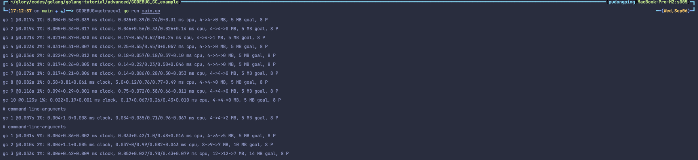

# 用 GODEBUG 看 GC

通过设置 `gctrace=1` 后使得垃圾收集器向标准错误流发出 GC 运行信息，以此来观察程序的 GC 运行情况。

```bash
GODEBUG=gctrace=1 go run main.go
```



模版内容如下：

```bash
gc # @#s #%: #+#+# ms clock, #+#/#/#+# ms cpu, #->#-># MB, # MB goal, # P
```

| 占位符 | 说明                               |
| --- |----------------------------------|
| gc # | GC 执行次数的编号，每次叠加（第几次 GC）          |
| @#s | 自程序启动后到当前的具体秒数                   |
| #% | 自程序启动以来在 GC 中花费的时间百分比            |
| #+...+# | GC 的标记工作共使用的 CPU 时间占总 CPU 时间的百分比 |
| #->#-># MB | 分别表示 GC 启动时, GC 结束时, GC 活动时的堆大小  |
| # MB goal  | 下一次触发 GC 的内存占用阈值                 |
| # P | 当前使用的处理器 P 的数量                   |