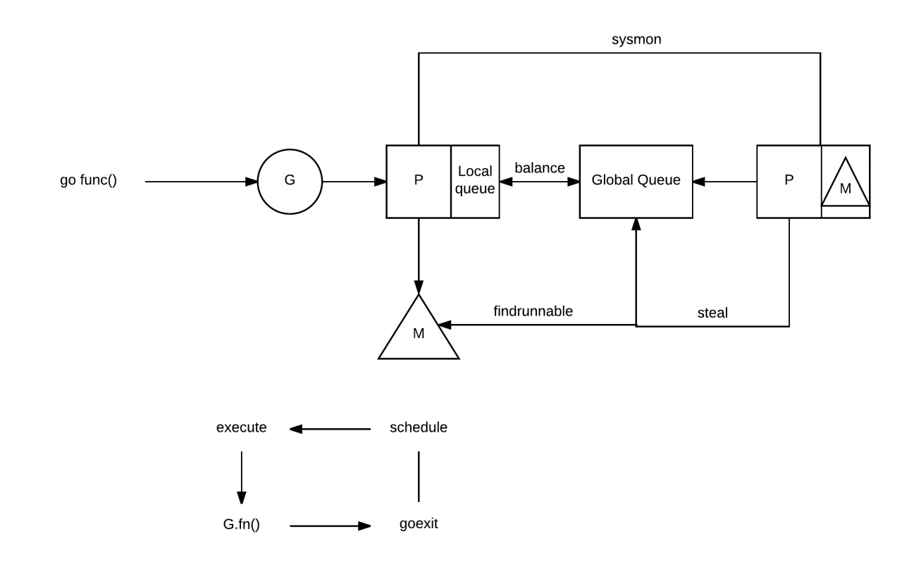
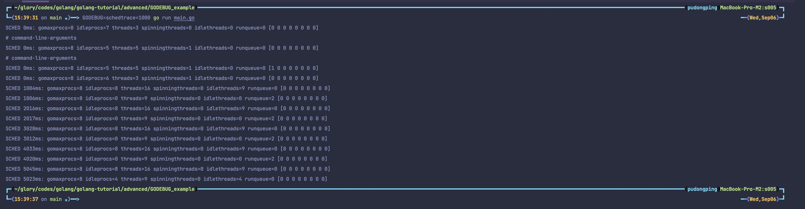
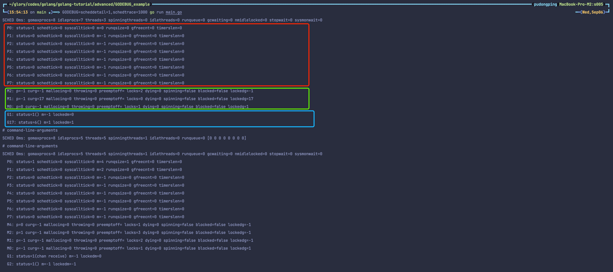

# 用 GODEBUG 看调度跟踪 GMP

## Go Scheduler 调度的基础知识

GMP 模型。可详细阅读 [Go Runtime Scheduler](https://speakerdeck.com/retervision/go-runtime-scheduler)

- G：Goroutine，实际上我们每次调用 go func 就是生成了一个 G。
- P：Processor，处理器，一般 P 的数量就是处理器的核数，可以通过 `GOMAXPROCS` 进行修改。
- M：Machine，系统线程。



1. 当我们执行 `go func()` 时，实际上就是创建一个全新的 Goroutine，我们称它为 G。
2. 新创建的 G 会被放入 P 的本地队列（Local Queue）或全局队列（Global Queue）中，准备下一步的动作。需要注意的一点，这里的 P 指的是创建 G 的 P。
3. 唤醒或创建 M 以便执行 G。
4. 不断地进行事件循环
5. 寻找在可用状态下的 G 进行执行任务
6. 清除后，重新进入事件循环

## GODEBUG

GODEBUG 变量可以控制运行时内的调试变量，参数以逗号分隔。

### schedtrace：设置 schedtrace=X 参数可以使运行时在每 X 毫秒发出一行调度器的摘要信息到标准 err 输出中。

```bash
GODEBUG=schedtrace=1000 go run main.go
```



- sched：每一行都代表调度器的调试信息，后面提示的毫秒数表示启动到现在的运行时间，输出的时间间隔受 schedtrace 的值影响。
- gomaxprocs：当前的 CPU 核心数（GOMAXPROCS 的当前值）。
- idleprocs：空闲的处理器数量，后面的数字表示当前的空闲数量。
- threads：OS 线程数量，后面的数字表示当前正在运行的线程数量。
- spinningthreads：自旋状态的 OS 线程数量。
- idlethreads：空闲的线程数量。
- runqueue：全局队列中中的 Goroutine 数量，而后面的 [1 0 0 0 0 0 0 0] 则分别代表这 8 个 P 的本地队列正在运行的 Goroutine 数量。

### scheddetail：设置 schedtrace=X 和 scheddetail=1 可以使运行时在每 X 毫秒发出一次详细的多行信息，信息内容主要包括调度程序、处理器、OS 线程 和 Goroutine 的状态。

```bash
# 抽取了 1000ms 时的调试信息来查看
GODEBUG=scheddetail=1,schedtrace=1000 go run main.go
```




#### G

```bash
  G1: status=1() m=-1 lockedm=0
  G17: status=6() m=1 lockedm=1
```

- status：G 的运行状态。
- m：隶属哪一个 M。
- lockedm：是否有锁定 M

G 的状态值：

| 状态                                                           |	值|	含义|
|--------------------------------------------------------------|---|---|
| _Gidle	                                                      |0	|刚刚被分配，还没有进行初始化。|
| _Grunnable	                                                  |1|	已经在运行队列中，还没有执行用户代码。|
| _Grunning	                                                   |2|	不在运行队列里中，已经可以执行用户代码，此时已经分配了 M 和 P。|
| _Gsyscall	                                                   |3|	正在执行系统调用，此时分配了 M。|
| _Gwaiting	                                                   |4|	在运行时被阻止，没有执行用户代码，也不在运行队列中，此时它正在某处阻塞等待中。|
| _Gmoribund_unused 	|5|	尚未使用，但是在 gdb 中进行了硬编码。                   |
| _Gdead	|6|	尚未使用，这个状态可能是刚退出或是刚被初始化，此时它并没有执行用户代码，有可能有也有可能没有分配堆栈。 |
| _Genqueue_unused	|7|	尚未使用。                                     |
| _Gcopystack	|8|	正在复制堆栈，并没有执行用户代码，也不在运行队列中。                     |


#### M

```bash
  M2: p=-1 curg=-1 mallocing=0 throwing=0 preemptoff= locks=2 dying=0 spinning=false blocked=false lockedg=-1
  M1: p=-1 curg=17 mallocing=0 throwing=0 preemptoff= locks=0 dying=0 spinning=false blocked=false lockedg=17
  M0: p=0 curg=-1 mallocing=0 throwing=0 preemptoff= locks=1 dying=0 spinning=false blocked=false lockedg=1
```

- p：隶属哪一个 P。
- curg：当前正在使用哪个 G。
- mallocing：是否正在分配内存。
- throwing：是否抛出异常。
- preemptoff：不等于空字符串的话，保持 curg 在这个 m 上运行。

#### P

```bash
  P0: status=1 schedtick=0 syscalltick=0 m=0 runqsize=0 gfreecnt=0 timerslen=0
  P1: status=0 schedtick=0 syscalltick=0 m=-1 runqsize=0 gfreecnt=0 timerslen=0
  P2: status=0 schedtick=0 syscalltick=0 m=-1 runqsize=0 gfreecnt=0 timerslen=0
  P3: status=0 schedtick=0 syscalltick=0 m=-1 runqsize=0 gfreecnt=0 timerslen=0
  P4: status=0 schedtick=0 syscalltick=0 m=-1 runqsize=0 gfreecnt=0 timerslen=0
  P5: status=0 schedtick=0 syscalltick=0 m=-1 runqsize=0 gfreecnt=0 timerslen=0
  P6: status=0 schedtick=0 syscalltick=0 m=-1 runqsize=0 gfreecnt=0 timerslen=0
  P7: status=0 schedtick=0 syscalltick=0 m=-1 runqsize=0 gfreecnt=0 timerslen=0
```

- status：P 的运行状态。
- schedtick：P 的调度次数。
- syscalltick：P 的系统调用次数。
- m：隶属哪一个 M。
- runqsize：运行队列中的 G 数量。
- gfreecnt：可用的 G（状态为 Gdead）。

P 的运行状态：

| 状态                                                 |	值|	含义|
|----------------------------------------------------|---|---|
| _Pidle	|0|	刚刚被分配，还没有进行进行初始化。|                         
| _Prunning	|1|	当 M 与 P 绑定调用 acquirep 时，P 的状态会改变为      _Prunning。|
|  _Psyscall	|2|	正在执行系统调用。|                              
|  _Pgcstop	|3|	暂停运行，此时系统正在进行 GC，直至 GC 结束后才会转变到下一个状态阶段。| 
|  _Pdead	|4|	废弃，不再使用。|                                  