# Go 大杀器之性能剖析 PProf

在 Go 语言中，PProf 是用于可视化和分析性能分析数据的工具，PProf 以 profile.proto 读取分析样本的集合，并生成报告以可视化并帮助分析数据（支持文本和图形报告）。

## 第一种采集方式：通过在应用程序中埋入方法进行采集。（net/http/pprof：基于 HTTP Server 运行，并且可以采集运行时数据进行分析。）

[详见](./func_in_app)

### 访问

#### 1. 通过浏览器访问 http://127.0.0.1:6060/debug/pprof/ 

- allocs：查看过去所有内存分配的样本，访问路径为 $HOST/debug/pprof/allocs。
- block：查看导致阻塞同步的堆栈跟踪，访问路径为 $HOST/debug/pprof/block。
- cmdline： 当前程序的命令行的完整调用路径。
- goroutine：查看当前所有运行的 goroutines 堆栈跟踪，访问路径为 $HOST/debug/pprof/goroutine。
- heap：查看活动对象的内存分配情况， 访问路径为 $HOST/debug/pprof/heap。
- mutex：查看导致互斥锁的竞争持有者的堆栈跟踪，访问路径为 $HOST/debug/pprof/mutex。
- profile： 默认进行 30s 的 CPU Profiling，得到一个分析用的 profile 文件，访问路径为 $HOST/debug/pprof/profile。
- threadcreate：查看创建新 OS 线程的堆栈跟踪，访问路径为 $HOST/debug/pprof/threadcreate。

如果你在对应的访问路径上新增 `?debug=1` 的话，就可以直接在浏览器访问，若不新增 `debug` 参数，那么将会直接下载对应的 profile 文件。

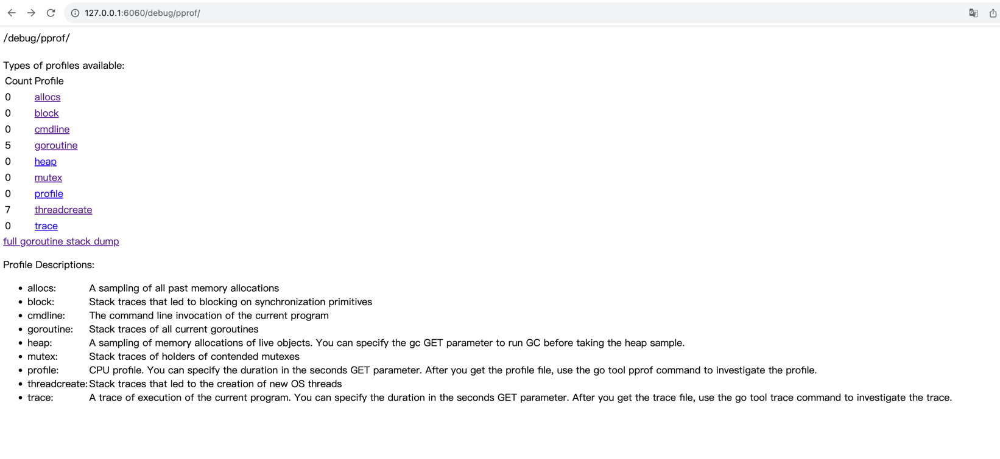

另外还有一点需要注意，debug 的访问方式是具有时效性的，在实际场景中，我们常常需要及时将当前状态下的 profile 文件给存储下来，便于二次分析。

#### 2. 通过命令行访问

##### 2.1、CPU Profiling （CPU 分析，按照一定的频率采集所监听的应用程序 CPU（含寄存器）的使用情况，可确定应用程序在主动消耗 CPU 周期时花费时间的位置。）

```bash
go tool pprof "http://localhost:6060/debug/pprof/profile?seconds=60"
```

执行该命令后，需等待 60 秒（可调整 seconds 的值），pprof 会进行 CPU Profiling，结束后将默认进入 pprof 的命令行交互式模式，可以对分析的结果进行查看或导出。
另外如果你所启动的 HTTP Server 是 TLS 的方式，那么在调用 `go tool pprof` 时，需要将调用路径改为：`go tool pprof https+insecure://localhost:6060/debug/pprof/profile\?seconds\=60`

- flat：函数自身的运行耗时。
- flat%：函数自身在 CPU 运行耗时总比例。
- sum%：函数自身累积使用 CPU 总比例。
- cum：函数自身及其调用函数的运行总耗时。
- cum%：函数自身及其调用函数的运行耗时总比例。
- Name：函数名。

**pprof 还支持大量的其它命令，具体可在 pprof 交互模式下键入 `help` 来查看帮助说明**

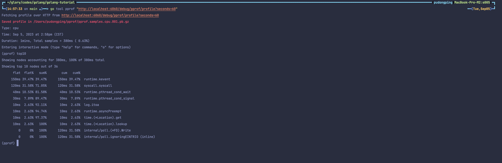

##### 2.2、 Heap Profiling（内存分析，在应用程序进行堆分配时记录堆栈跟踪，用于监视当前和历史内存使用情况，以及检查内存泄漏。）

```bash
go tool pprof http://localhost:6060/debug/pprof/heap
```

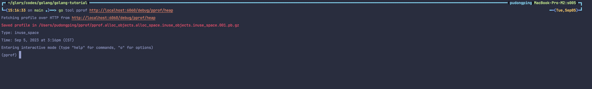

###### inuse_space：分析应用程序的常驻内存占用情况

```bash
go tool pprof -inuse_space http://localhost:6060/debug/pprof/heap
```

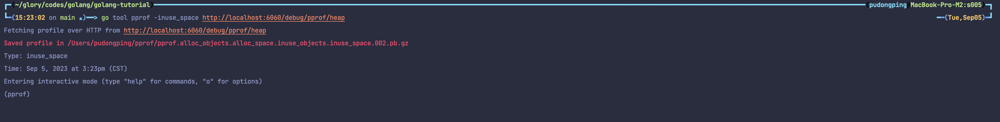

###### alloc_objects：分析应用程序的内存临时分配情况

```bash
go tool pprof -alloc_objects http://localhost:6060/debug/pprof/heap
```

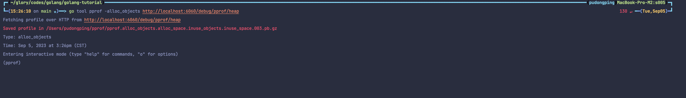

另外还有 `inuse_objects` 和 `alloc_space` 类别，分别对应查看每个函数所分别的对象数量和查看分配的内存空间大小。

##### 2.3、Goroutine Profiling （Goroutine 分析，可以对当前应用程序正在运行的 Goroutine 进行堆栈跟踪和分析。这项功能在实际排查中会经常用到，因为很多问题出现时的表象就是 Goroutine 暴增，而这时候我们要做的事情之一就是查看应用程序中的 Goroutine 正在做什么事情，因为什么阻塞了，然后再进行下一步。）

```bash
go tool pprof http://localhost:6060/debug/pprof/goroutine
```

在查看 goroutine 时，我们可以使用 `traces` 命令，这个命令会打印出对应的所有调用栈，以及指标信息，可以让我们很便捷的查看到整个调用链路有什么，分别在哪里使用了多少个 goroutine，并且能够通过分析查看到谁才是真正的调用方。

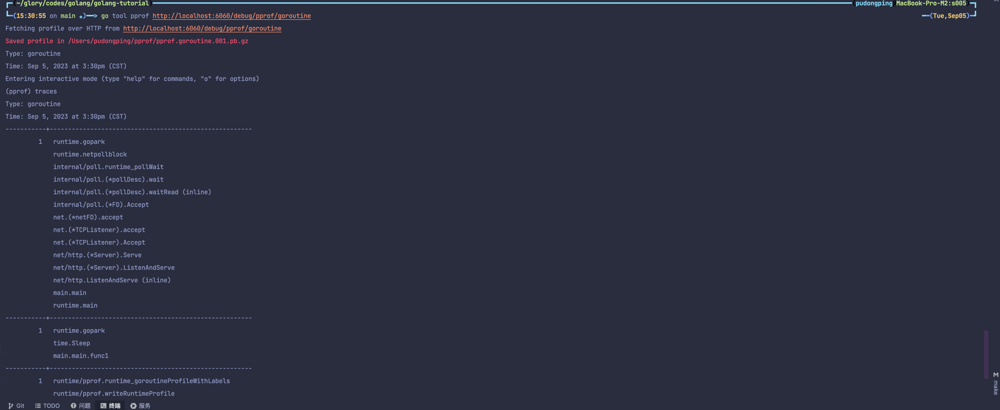

##### 2.4、 Mutex Profiling （互斥锁分析，报告互斥锁的竞争情况，默认不开启，需要调用 runtime.SetMutexProfileFraction 进行设置）

此时示例在 `main2.go` 文件中，因此需要运行 `go run main2.go`

我们可以在输出的分析中比较准确的看到引起互斥锁的函数在哪里，锁开销在哪里，在本例中是第 24 行。

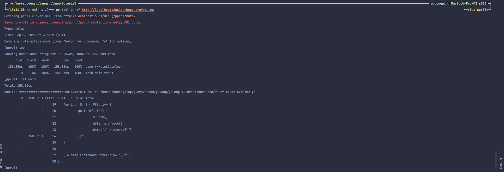

#### 3. 查看可视化界面

启动应用程序 `go run main.go` 然后使用运行下面的命令

```bash
wget http://127.0.0.1:6060/debug/pprof/profile
```

默认需要等待 30 秒，执行完毕后可在当前目录下发现采集的文件 profile，针对可视化界面我们有两种方式可进行下一步分析：

1. 方法一（**推荐**）：该命令将在所指定的端口号运行一个 PProf 的分析用的站点。

```bash
go tool pprof -http=:6001 profile 
```

如果出现错误提示 `Could not execute dot; may need to install graphviz.` 那么意味着你需要安装 `graphviz` 组件。如果是在 `Macbook` 下使用的是 `Homebrew` 那么可直接 `brew install graphviz` 进行安装。

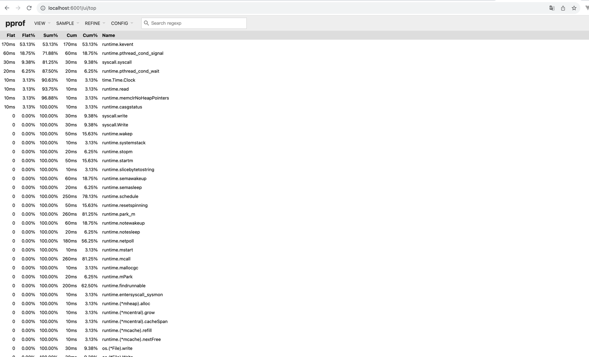

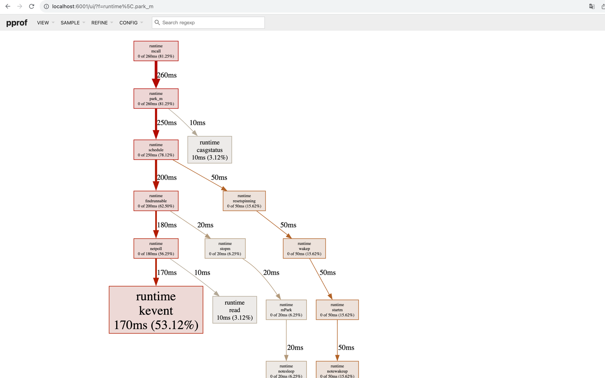

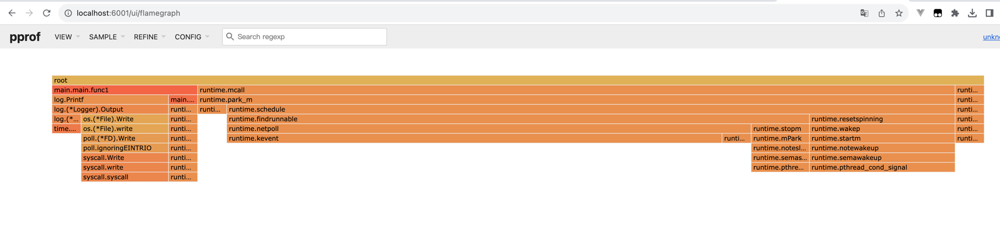

2. 方法二：通过 `web` 命令将以 svg 的文件格式写入图形，然后在 Web 浏览器中将其打开。

```bash
go tool pprof profile
```

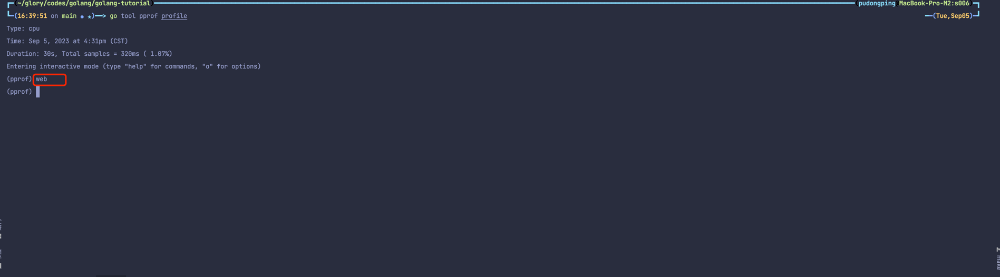

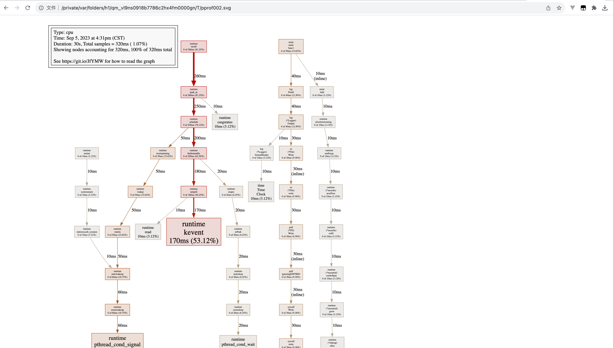

另外方法一所运行的站点，实际上包含了方法二的内容（svg 图片），并且更灵活，因此非特殊情况，我们会**直接使用方法一**的方式运行站点来做观察和分析。


## 第二种方式：通过测试用例做剖析。（go test：通过运行测试用例，并指定所需标识来进行采集。）

[详见](./analyze_by_test_case)

## 第三种方式：通过 Lookup 写入文件做剖析。（runtime/pprof：采集程序（非 Server）的指定区块的运行数据进行分析。）

[详见](./analyze_by_file_loopup)


## 排查示例

相隔一段时间后，拉取相应的分析数据

```bash

go tool pprof -alloc_objects http://localhost:6060/debug/pprof/heap

# 可能在 5min 后再次执行
go tool pprof -alloc_objects http://localhost:6060/debug/pprof/heap

# 通过 -base 指令实现对比
# 该命令会以 001.pb.gz 文件作为基准，然后对 002.pb.gz 与 001.pb.gz 进行对比，因此接下来的指令分析，都是基于 002.pb.gz 和 001.pb.gz 的对比结果尽心的
go tool pprof -base ./pprof.alloc_objects.alloc_space.inuse_objects.inuse_space.001.pb.gz ./pprof.alloc_objects.alloc_space.inuse_objects.inuse_space.002.pb.gz

# 第一步，使用 top 命令查看
# 第二步，使用 traces 命令查看更精细的调用栈信息
# 第三步，使用 list 命令查看在执行 traces 命令后，所输出的调用堆栈信息中的具体调用函数是在哪里发起的。eg：`list xxxxxFunc`
# list 命令在函数名不明确的情况下，是会进行默认模糊匹配的。

```