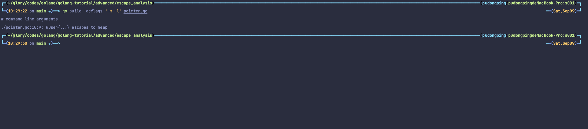
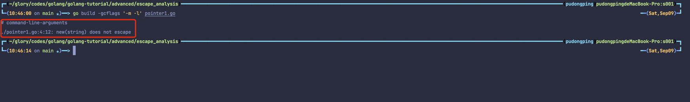
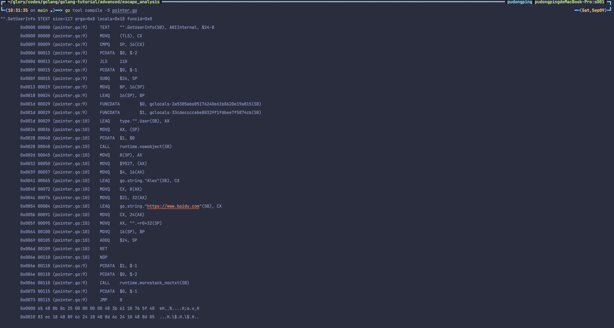

# 逃逸分析 - 变量在哪儿

## 什么是堆/栈

- 堆（Heap）：一般来讲是人为手动进行管理，手动申请、分配、释放。一般所涉及的内存大小并不定，一般会存放较大的对象。另外其分配相对慢，涉及到的指令动作也相对多
- 栈（Stack）：由编译器进行管理，自动申请、分配、释放。一般不会太大，我们常见的函数参数（不同平台允许存放的数量不同），局部变量等等都会存放在栈上

## 什么是逃逸分析

在编译程序优化理论中，逃逸分析是一种确定指针动态范围的方法，简单来说就是分析在程序的哪些地方可以访问到该指针，通俗地讲，逃逸分析就是确定一个变量要放堆上还是栈上，规则如下：

1. 是否有在其他地方（非局部）被引用。只要**有可能**被引用了，那么它**一定**分配到堆上。否则分配到栈上
2. 即使没有被外部引用，但对象过大，无法存放在栈区上。依然有可能分配到堆上

对此你可以理解为，逃逸分析是*编译器用于决定变量分配到堆上还是栈上的一种行为*。

## 在什么阶段确立逃逸

Go 语言是在**编译阶段确立逃逸**，注意并~~*不是在运行时*~~。

## 为什么需要逃逸

这个问题我们可以反过来想，如果变量都分配到堆上了会出现什么事情？例如：

- 垃圾回收（GC）的压力不断增大
- 申请、分配、回收内存的系统开销增大（相对于栈）
- 动态分配产生一定量的内存碎片

其实总的来说，就是频繁申请、分配堆内存是有一定 “代价” 的。会影响应用程序运行的效率，间接影响到整体系统。因此 “按需分配” 最大限度的灵活利用资源，才是正确的治理之道，这就是为什么需要逃逸分析的原因之一。

## 怎么确定是否逃逸

第一种，我们可以通过编译器提供的指令 `-gcflags` 就可以看到详细的逃逸分析过程

- **-m**：打印出逃逸分析的优化策略，实际上最多总共可以用 4 个 `-m`，但是这样子调试的信息量较大，一般用一个就足够了。
- **-l** ：禁用函数内联，在这里禁用掉 inline 能更好的观察逃逸情况，减少干扰。

```bash
go build -gcflags '-m -l' pointer.go

# eg: go build -gcflags '-m -m -m -m -l' pointer.go 
```



并不是所有的指针类型就会被逃逸。很核心的一点就是***它有没有被作用域之外所引用***，而这里作用域仍然保留在 `main` 中，因此它没有发生逃逸，因此与作用域也是决定是否逃逸的重要原因之一。



第二种，通过反编译命令查看

```bash
go tool compile -S pointer.go
```

可以通过 `go tool compile -help` 查看所有允许传递给编译器的标识参数



## 比较重要的认知

- 静态分配到栈上，性能一般会比动态分配到堆上好。
- 底层分配到堆，还是栈，实际上对你来说是透明的，不需要过度关心、纠结。
- 每个 Go 版本的逃逸分析都会有所不同（会改变，会优化）。
- 到处都用指针传递并不一定是最好的，要合理的用对。
- 遇到怀疑，直接通过 `go build -gcflags '-m -l'` 可以看到逃逸分析的过程和结果，胜过道听途说。