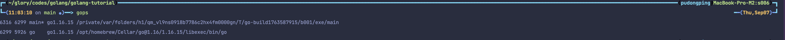
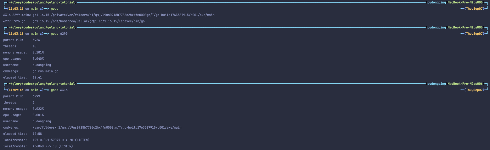
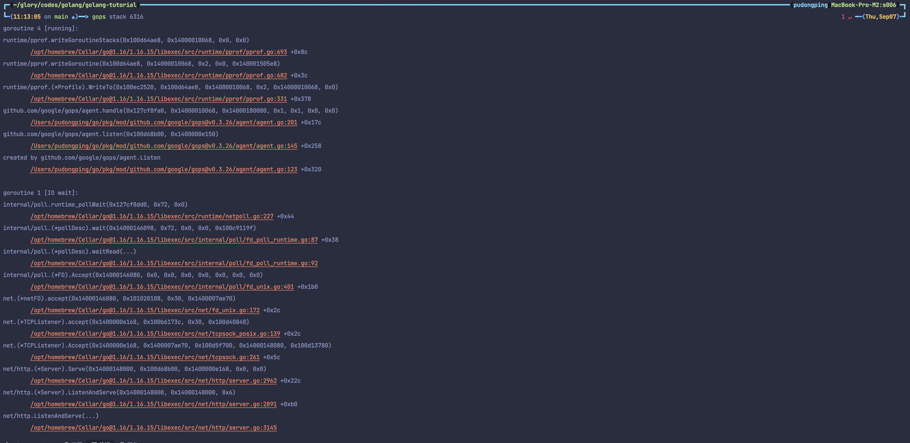
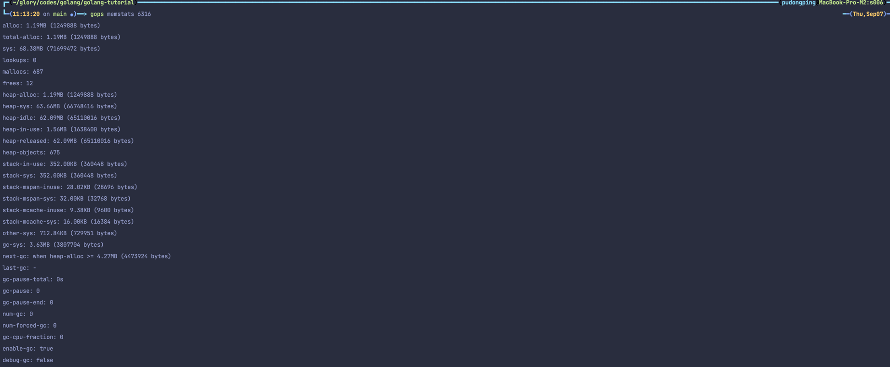
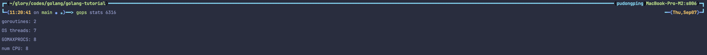
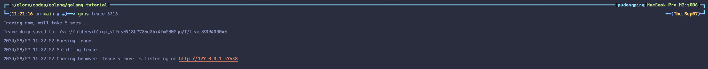
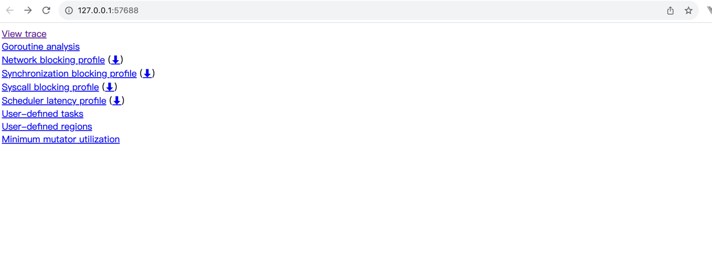
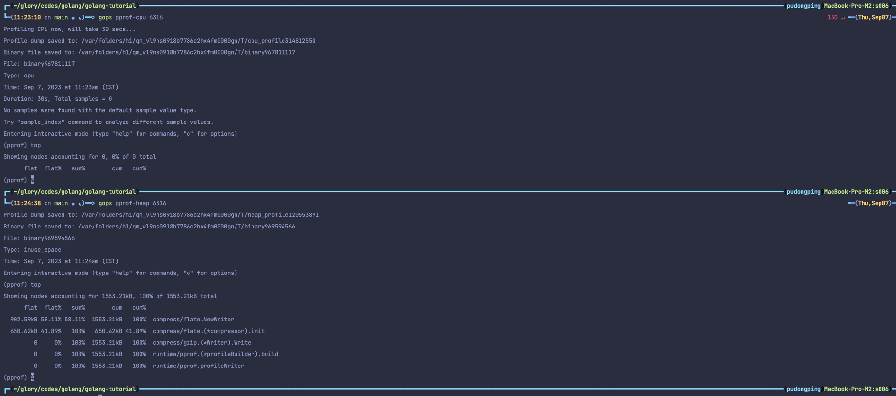

# Go 进程诊断工具 gops

## 安装 [gops](https://github.com/google/gops)

```bash
# for go 1.16+
go install github.com/google/gops@v0.3.26
```

## 官方示例

```go
package main

import (
	"log"
	"time"

	"github.com/google/gops/agent"
)

func main() {
	if err := agent.Listen(agent.Options{}); err != nil {
		log.Fatal(err)
	}
	time.Sleep(time.Hour)
}
```

## 查看

直接执行 `gops` 命令查看。



### 查看指定进程信息

获取 Go 进程的概要信息，包括父级 PID、线程数、内存/CPU 使用率、运行者的账户名、进程的启动命令行参数、启动后所经过的时间以及 gops 的 agent 监听信息（若无植入 agent，则没有这项信息）。



### 查看调用栈信息



### 查看内存使用



### 查看运行时信息

获取 Go 运行时的基本信息，包括当前的 Goroutine 数量、系统线程、GOMAXPROCS 数值以及当前系统的 CPU 核数。



### 查看 trace 信息

与 `go tool trace` 作用基本一致。




### 查看 profile 信息

与 `go tool pprof` 作用基本一致。


