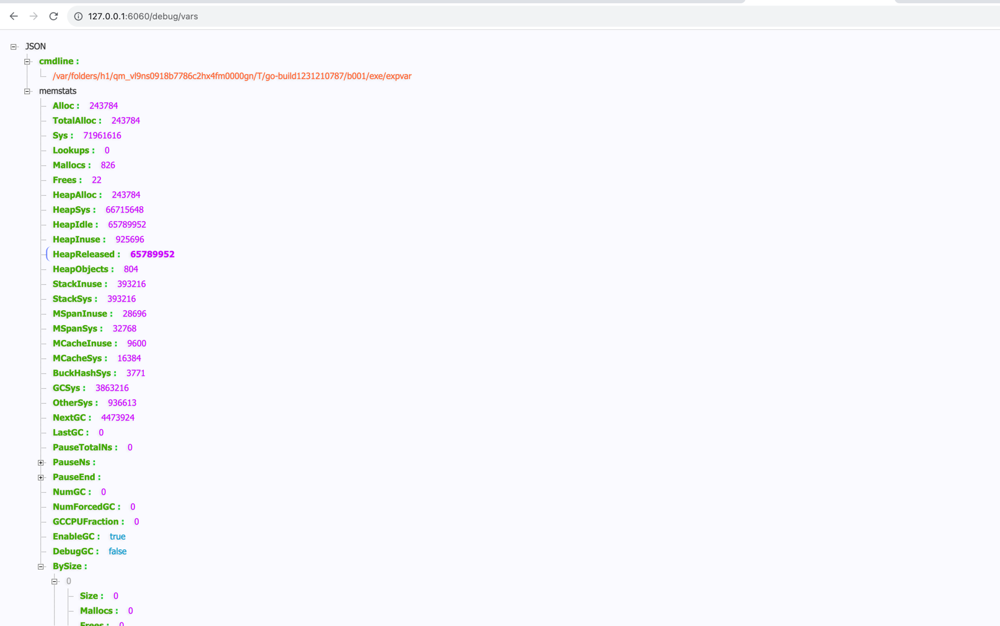
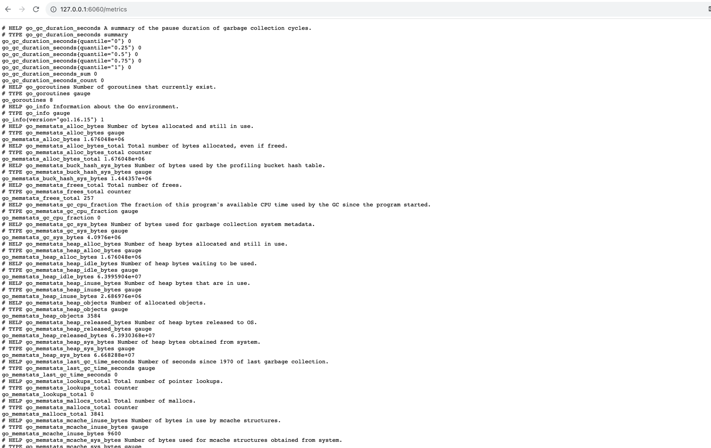

# 公开和发布度量指标

## 通过 Expvar

```bash
go run expvar.go
```

访问 `/debug/vars` 路由，可见：

- cmdline：当前 Go 程序运行时的命令行参数。
- [memstats](https://pkg.go.dev/runtime#MemStats)：当前 Go 程序的运行时统计信息（包括内存、垃圾回收等等）



## 通过 Prometheus

```bash
go run prometheus_client.go
```

访问 `/metrics` 路由，可见：

