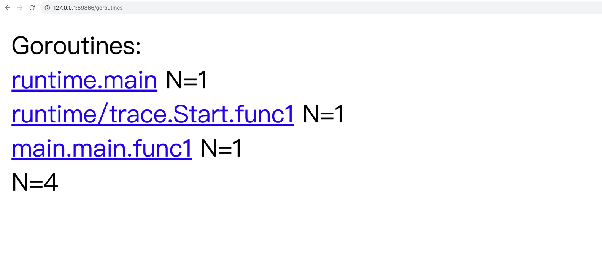
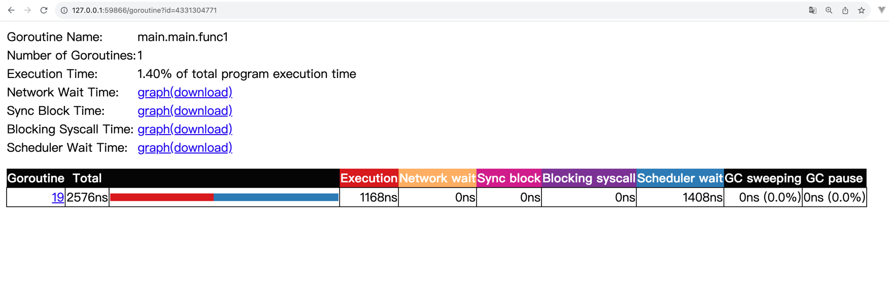

# Go 大杀器之跟踪剖析 trace

## 通过 `runtime/trace` 内嵌代码

生成跟踪文件

```bash
go run main1.go 2> trace.out
```

启动可视化界面

```bash
go tool trace trace.out
```

- View trace：查看跟踪
- Goroutine analysis：Goroutine 分析
- Network blocking profile：网络阻塞概况
- Synchronization blocking profile：同步阻塞概况
- Syscall blocking profile：系统调用阻塞概况
- Scheduler latency profile：调度延迟概况
- User defined tasks：用户自定义任务
- User defined regions：用户自定义区域
- Minimum mutator utilization：最低 Mutator 利用率


第一步：查看调度延迟概况 *Scheduler latency profile* （访问路由 `/sched`） 


第二步：Goroutine 分析 *Goroutine analysis* （访问路由 `/goroutine`）

我们能通过这个功能看到整个运行过程中，每个函数块有多少个 Goroutine 在跑，并且观察每个的 Goroutine 的运行开销都花费在哪个阶段。



| 名称 |	含义 |
| --- | --- |
|Execution Time	|执行时间|
|Network Wait Time	|网络等待时间|
|Sync Block Time	|同步阻塞时间|
|Blocking Syscall Time	|调用阻塞时间|
|Scheduler Wait Time	|调度等待时间|
|GC Sweeping	|GC 清扫|
|GC Pause	|GC 暂停|



第三步：查看跟踪 *View trace* （访问路由 `/trace`）


## 通过 `net/http/pprof` 内嵌代码

```bash
# 先启动服务
go run main2.go

# 访问路由
curl http://127.0.0.1:6060/debug/pprof/trace\?seconds\=20 > trace.out 

# 启动可视化界面
go tool trace trace.out
```