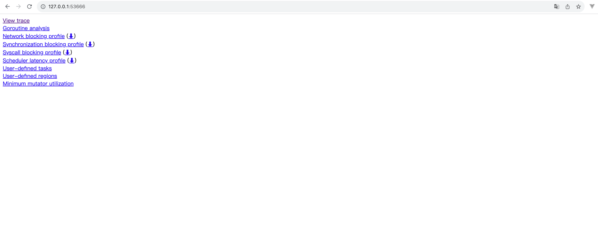
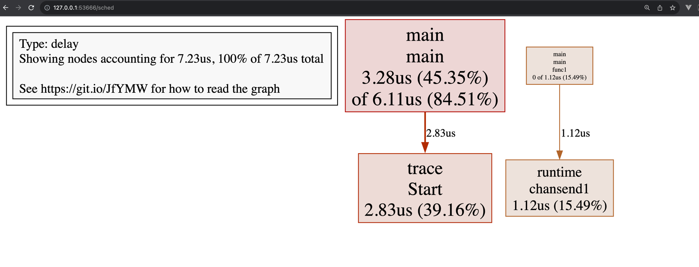

# Go 大杀器之跟踪剖析 trace

生成跟踪文件

```bash
go run main.go 2> trace.out
```

启动可视化界面

```bash
go tool trace trace.out
```

浏览器访问 http://127.0.0.1:53666

- View trace：查看跟踪
- Goroutine analysis：Goroutine 分析
- Network blocking profile：网络阻塞概况
- Synchronization blocking profile：同步阻塞概况
- Syscall blocking profile：系统调用阻塞概况
- Scheduler latency profile：调度延迟概况
- User defined tasks：用户自定义任务
- User defined regions：用户自定义区域
- Minimum mutator utilization：最低 Mutator 利用率



第一步查看调度延迟概况 [Scheduler latency profile](http://127.0.0.1:53666/sched)

