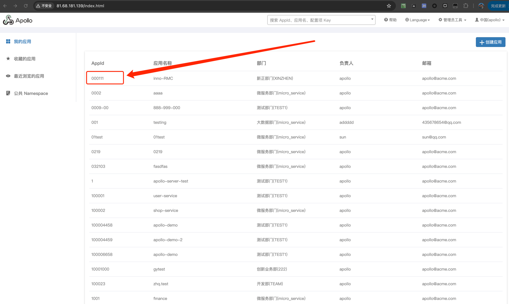
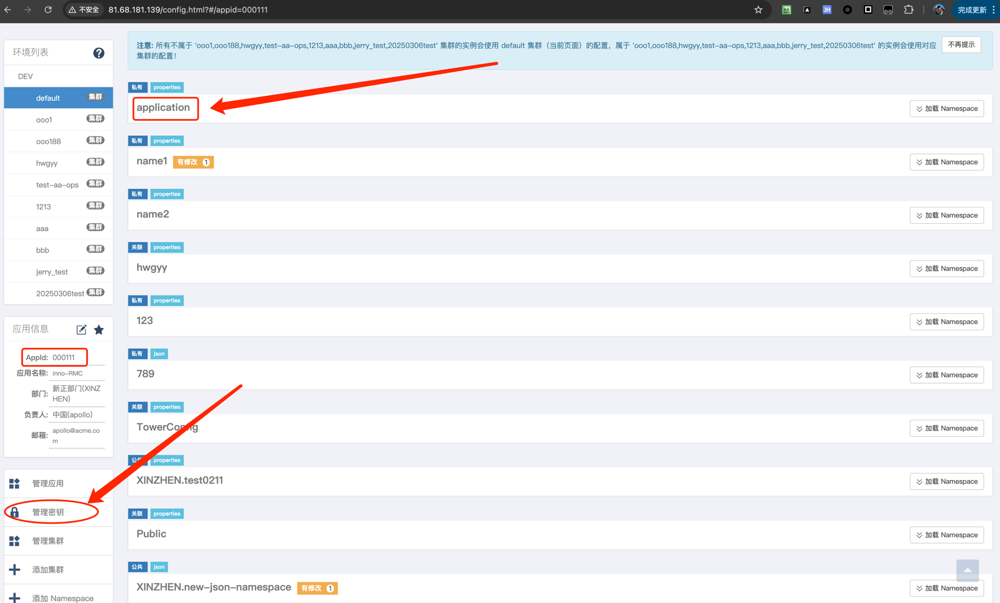
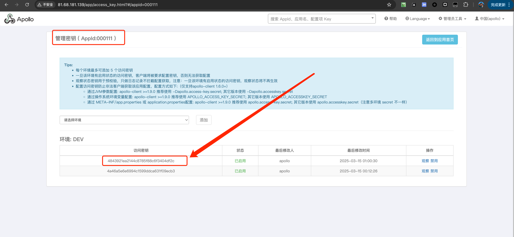

# Apollo

[Apollo（阿波罗）](https://github.com/apolloconfig/apollo)是一款可靠的分布式配置管理中心，诞生于携程框架研发部，能够集中化管理应用不同环境、不同集群的配置，配置修改后能够实时推送到应用端，并且具备规范的权限、流程治理等特性，适用于微服务配置管理场景。

[官方文档](https://www.apolloconfig.com/#/zh/README) 写的非常清晰，建议多看看。

## 测试

Apollo 官方提供了一个开发环境，这样我们就可以避免在本地搭建环境，可以直接使用官方提供的开发环境进行测试。

Demo Environment:  
http://81.68.181.139
User/Password: apollo/admin

```go
	c := &config.AppConfig{
		AppID:          "000111",
		Cluster:        "dev",
		IP:             "http://81.68.181.139:8080",
		NamespaceName:  "application",
		IsBackupConfig: true,
		Secret:         "4843921ea2144c8785f88c6f3404df2c",
	}
```







直接执行 `go run client.go` 即可看到控制台会有打印出来的配置信息。

运行命令之后，我们还会发现会将 AppID 下的 NamespaceName 配置进行缓存到本地。

更多使用示例，可以参考 [apolloconfig/agollo 示例](https://github.com/zouyx/agollo_demo)