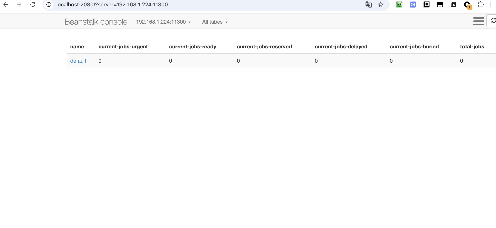
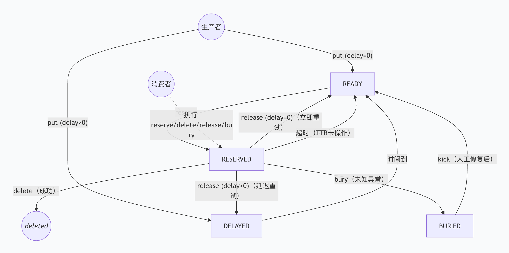

# Beanstalkd

## Beanstalkd 中几个非常重要的概念

### 1. Job —— 任务

#### 是什么？

**Job** 是 Beanstalkd 中最基本的工作单元，可以理解为一个需要被异步处理的任务。它类似于其他消息队列中的 **消息（Message）**。

#### 一个 Job 包含什么？
每个 Job 主要由以下几部分组成：
- **ID**：全局唯一的数字标识，当生产者放入任务时，Beanstalkd 会自动分配。
- **数据（Body）**：实际要处理的内容，可以是任意字节流（比如一个 JSON 字符串、一段文本等）。
- **优先级（Priority）**：一个 0~2^32 的整数，**数值越小优先级越高**。高优先级的任务会被消费者优先取走。
- **状态**：Job 在整个生命周期中会处于不同的状态（如 READY、RESERVED 等），Beanstalkd 通过状态来管理任务的流转。

#### Job 的常见操作
- **put**：生产者将 Job 放入队列。
- **reserve**：消费者从队列中取出一个 Job，此时 Job 状态变为 RESERVED，表示正在被处理。
- **delete**：消费者处理成功后，删除 Job，任务结束。
- **release**：消费者处理失败，将 Job 重新放回队列（可以立即重试，也可以延迟重试）。
- **bury**：消费者遇到未知错误，将 Job“埋”起来，等待人工介入。
- **kick**：将 buried 状态的 Job 重新放回 READY 队列，让消费者再次尝试。


### 2. Tube —— 管道

#### 是什么？

**Tube** 可以理解为一个**任务队列容器**，类似于消息队列中的 **主题（Topic）**。每个 Tube 里可以存放多个 Job，不同的 Tube 之间相互隔离，互不影响。

#### 为什么需要 Tube？

在实际应用中，我们往往有不同类型的任务，比如：
- 邮件发送任务
- 图片处理任务
- 订单超时检查任务

如果所有任务都混在同一个队列里，消费者很难区分和处理。通过 Tube，我们可以**将不同类型的任务分类存放**，每个 Tube 有自己的生产者和消费者，互不干扰。

#### 默认 Tube

Beanstalkd 启动后会自动创建一个名为 `default` 的 Tube。如果你不指定，生产者和消费者默认都会使用这个 Tube。

#### 如何操作 Tube？

- 生产者通过 `use <tube-name>` 命令指定将 Job 放入哪个 Tube。
- 消费者通过 `watch <tube-name>` 命令关注一个或多个 Tube，从中获取任务；也可以通过 `ignore` 取消关注。


### 3. Producer —— 生产者

#### 是什么？
**Producer** 是产生任务的一方，也就是把 Job 放入 Beanstalkd 的程序。

#### 生产者做什么？
生产者只需要调用 `put` 命令，将一个 Job 放入指定的 Tube 中。`put` 时可以设置几个关键参数：
- **优先级**：控制任务被消费的紧急程度。
- **延迟（Delay）**：任务在放入队列后，等待多少秒才进入 READY 状态（即变为可被消费）。适用于需要定时执行的任务。
- **TTR（Time To Run）**：消费者处理该任务的最大允许时间（秒）。如果消费者在 TTR 内没有完成处理（即没有 delete/release/bury），Beanstalkd 会认为消费者挂了，自动将该任务重新放回 READY 队列，让其他消费者处理。

#### 生产者的特点

- 生产者只负责“放”，不关心任务什么时候被处理、由谁处理。
- 一个生产者可以向多个 Tube 放入任务（通过切换 `use` 的 Tube）。


### 4. Consumer —— 消费者

#### 是什么？
**Consumer** 是处理任务的一方，也就是从 Beanstalkd 中取出 Job 并执行的程序。

#### 消费者做什么？
消费者通过 `reserve` 命令从关注的 Tube 中**阻塞地**获取一个 Job。一旦取到，该 Job 状态变为 RESERVED，表示被该消费者独占，其他消费者无法再取到这个 Job。

处理完成后，消费者需要根据结果执行以下操作之一：
- **delete**：任务处理成功，告诉 Beanstalkd 可以删除该 Job。
- **release**：任务处理失败，希望重新尝试。可以指定新的延迟时间，让 Job 重新进入 READY 或 DELAYED 状态。
- **bury**：遇到无法处理的异常（比如业务逻辑错误、依赖服务不可用等），先将 Job“埋”起来，等待管理员排查问题后，再用 `kick` 命令将其恢复。

#### 消费者的特点
- 消费者可以同时关注多个 Tube（通过 `watch`），这样就能从多个队列中获取任务，实现负载均衡。
- 多个消费者可以同时监听同一个 Tube，Beanstalkd 会自动分配任务给空闲的消费者，实现任务的并行处理。
- 每个消费者在 `reserve` 一个 Job 后，必须在 TTR 时间内做出响应（delete/release/bury），否则任务会被超时释放，重新回到 READY 队列。

### 概念之间的关系

用一个简单的场景串联起来：

1. **生产者**（比如一个 Web 后端）收到用户注册请求，需要发送一封欢迎邮件。它将邮件任务（Job）通过 `put` 放入名为 `email-tube` 的 **Tube** 中，并设置优先级为 100（较低），延迟为 0（立即处理），TTR 为 60 秒。
2. **Beanstalkd** 收到任务后，将其状态设为 READY，等待消费者取走。
3. 一个专门处理邮件的**消费者**（Worker）长期运行，它 `watch` 了 `email-tube`，并通过 `reserve` 获取到这个任务。
4. 消费者开始发送邮件，发送成功后调用 `delete`，任务被移除，生命周期结束。
5. 如果发送失败（比如邮箱格式错误），消费者调用 `bury`，任务进入 BURIED 状态，等待运维人员排查。
6. 运维人员修复问题后，通过 `kick` 命令将 buried 任务重新放回 READY 队列，消费者再次尝试处理。

##  docker 安装 beanstalkd

```bash
# 启动 beanstalkd 容器，默认端口为 11300
# 没有开启持久化，重启后数据会丢失，适合开发环境
docker run -d --name alex-dq \
-p 11300:11300 \
schickling/beanstalkd


 # 如果需要开启持久化
docker run -d --name alex-dq \
-p 11300:11300 \
-v $PWD/data:/data \
schickling/beanstalkd \
-b /data -f 100
```

### 持久化

1.  **`-b /data`**：告诉 beanstalkd 启用 binlog 机制，并将数据文件（binlog）写入容器内的 `/data` 目录。如果不加这个参数，beanstalkd 默认是在内存中运行的，重启后数据会丢失。
2.  **`-v $PWD/data:/data`**：将宿主机（你的电脑）当前目录下的 `data` 文件夹挂载到容器内的 `/data` 目录。

**只要这两个参数同时存在，容器内生成的数据文件就会实时同步保存到你宿主机的 `$PWD/data` 目录下。** 即使你删除了容器 (`docker rm`)，只要不删宿主机的 `data` 目录，下次重新启动容器挂载同一个目录，数据依然存在。

### 关于数据安全性

虽然开启了 `-b`，但 beanstalkd 默认并不是每写入一条数据就立即刷盘（fsync），而是有一定的策略（默认是根据系统调度）。如果想要更高的数据安全性（牺牲一点性能），可以添加 `-f` 参数：

- **`-f MS`**：每隔 MS 毫秒强制刷盘一次。

例如，每 100 毫秒刷盘一次：

```bash
docker run -d --name alex-dq \
-p 11300:11300 \
-v $PWD/data:/data \
schickling/beanstalkd \
-b /data -f 100
```

可以直接进入 `alex-dq` 容器执行 `beanstalkd` 命令

```bash
# 进入容器
docker exec -it alex-dq bash

# 查看 beanstalkd 命令行参数帮助
beanstalkd -h

# 会输出如下内容
Use: beanstalkd [OPTIONS]

Options:
 -b DIR   wal directory --> wal 文件所在目录（默认是 /data，开启持久化时需要指定）
 -f MS    fsync at most once every MS milliseconds (use -f0 for "always fsync") --> 每隔 MS 毫秒强制刷盘一次（默认是 0，即不强制）
 -F       never fsync (default) --> 不强制刷盘（默认是开启的）
 -l ADDR  listen on address (default is 0.0.0.0) --> 监听的 IP 地址（默认是 0.0.0.0，即监听所有地址）
 -p PORT  listen on port (default is 11300) --> 监听的端口号（默认是 11300）
 -u USER  become user and group --> 切换到指定用户和用户组
 -z BYTES set the maximum job size in bytes (default is 65535) --> 最大任务大小（默认是 65535 字节）
 -s BYTES set the size of each wal file (default is 10485760) --> 每个 wal 文件的大小（默认是 10485760 字节）
            (will be rounded up to a multiple of 512 bytes) --> 会被四舍五入到最近的 512 字节的倍数 
 -c       compact the binlog (default) --> 开启 binlog 压缩（默认是开启的）
 -n       do not compact the binlog --> 不开启 binlog 压缩
 -v       show version information --> 显示版本信息
 -V       increase verbosity --> 增加日志 verbosity（默认是 0）
 -h       show this help --> 显示帮助信息
```

### 检查是否安装成功

```bash
telnet 127.0.0.1 11300

# 输入 stats 命令，如果有大量统计信息返回，则表示成功
stats

# 如果不使用 telnet 也可以直接通过查看 docker 容器日志来检查是否安装成功
docker logs alex-dq
```


#### 一些常见的 telnet 操作 Beanstalkd

```bash
# 连接 beanstalkd 服务器
telnet 127.0.0.1 11300

# 查看所有 tube 列表
list-tubes

# 切换到指定 tube，如果我们要放入任务，需要先指定使用的 tube
# 使用 test_tube
use test_tube

# 放入一个任务
# 命令格式如下：
# put <优先级> <延迟秒数> <TTR 秒数> <数据字节数>\r\n<数据>\r\n
put 5 0 60 11
hello world
# 解释：
# 5 是优先级，0 表示最高优先级
# 0 是延迟秒数，0 表示立即放入 ready 队列
# 60 是 TTR 秒数，任务处理时间超过这个值，会被 beanstalkd 认为是失败，重新放入 ready 队列，也就是说消费者需要在 TTR 秒内处理完并删除任务，否则会被认为是失败
# 数据体长度 11 字节，即 hello world（注意末尾自动有 \r\n，但计算长度时只算实际内容）

# 放入第二个任务（带延迟）
put 2 5 60 5
later

# 查看任务统计（可选）
stats-job 1

# 关注 test_tube 队列，忽略 default 队列
watch test_tube
ignore default

# 预留并处理第一个任务
reserve
# 假设处理成功，删除它，其中这里的 1 是任务 ID，需要根据实际情况替换
delete 1

# 尝试预留第二个任务（还在延迟中，会阻塞？不，reserve 只会取 ready 的）
# 可以 peek 查看延迟队列
peek-delayed
# 会显示任务 2

# 直接 kick 不会影响 delayed，需要等时间到，或者用 kick-job 强行踢
# 但我们等几秒后，它会自动 ready，这里演示直接踢一个 buried 任务吧
# 先埋一个
put 3 0 60 4
bury
# 预留并埋掉
reserve
# 执行 bury 命令会将当前预留的任务埋掉，状态变为 buried，等待管理员处理
# 其中的 3 表示任务 ID，1 表示优先级，默认是 1024，数值越小优先级越高
bury 3 1
# 执行 kick 命令会将 buried 状态的任务重新放回 ready 队列，等待消费者处理
# 其中的 1 表示最多踢回 1 个任务，实际会根据优先级踢回最高优先级的任务
kick 1

# 清理最后的任务
reserve
delete 3

# 退出 telnet
# 先按 Ctrl+]，再输入 quit
quit
```

## 安装 beanstalk console Web 管理工具

```bash
# 其中 BEANSTALK_SERVERS 为 beanstalkd 的地址和端口
docker run -d \
--name alex-dq-console \
-p 2080:2080 \
-e BEANSTALK_SERVERS=192.168.1.224:11300 \
schickling/beanstalkd-console
```

可以直接通过浏览器访问 `http://localhost:2080/` 来查看 beanstalkd 的状态和队列信息。



## Beanstalk 任务流转过程



```bash
┌───────────┐      put with delay       ┌────────────┐
│ Producer  │ ─────────────────────────▶ │  DELAYED   │
└───────────┘        (延迟任务)           │ (延迟队列) │
                                          └────────────┘
                                                │
                                                │ 时间到
                                                ▼
┌───────────┐      put (delay=0)         ┌────────────┐
│ Producer  │ ─────────────────────────▶ │   READY    │
└───────────┘        (立即任务)           │ (就绪队列) │
                                          └────────────┘
                                                │
                                                │ reserve
                                                ▼
                                          ┌────────────┐
                                          │  RESERVED  │
                                          │ (正在处理) │
                                          └────────────┘
                                                │
                    ┌───────────────────────────┼───────────────────────────┐
                    │                           │                           │
                    │ delete                    │ release                   │ bury
                    │ (处理成功)                  │ (处理失败)                │ (未知异常)
                    ▼                           │                           │
              ┌───────────┐                     ▼                           ▼
              │ *deleted* │          ┌─────────────────────┐        ┌────────────┐
              │ 任务结束  │          │ release with delay  │        │   BURIED   │
              └───────────┘          │    (带延迟的重试)    │        │ (埋藏队列) │
                                      └─────────────────────┘        └────────────┘
                                            │                               │
                                            │ 如果 delay>0                  │ kick
                                            ▼                               │ (管理员修复后)
                                      ┌────────────┐                        │
                                      │  DELAYED   │ ◄──────────────────────┘
                                      │ (延迟队列) │
                                      └────────────┘
                                            │
                                            │ 时间到
                                            ▼
                                      ┌────────────┐
                                      │   READY    │
                                      │ (就绪队列) │
                                      └────────────┘
```

操作与状态解释

- **生产者（Producer）**：负责把任务（Job）放进队列。
    - 如果调用 `put` 时指定了 `delay > 0`，任务先进入 **DELAYED** 状态，倒计时结束后才进入 READY。
    - 如果 `delay = 0`，任务直接进入 **READY** 状态。

- **READY（就绪）**：任务已经准备好，等待消费者取走。

- **消费者（Worker）**：通过 `reserve` 命令从 READY 队列中取走一个任务，此时任务变为 **RESERVED**，表示该任务被某个消费者独占处理。

- **RESERVED（预留）**：消费者正在处理该任务。处理完成后根据结果执行不同操作：
    - **`delete`**：任务成功，彻底删除。
    - **`release`**：处理失败，想重试。可以指定新的 `delay`：
        - 如果 `delay = 0`，任务立即回到 READY 队列，等待重新被取。
        - 如果 `delay > 0`，任务先进入 DELAYED，倒计时后再回 READY。
    - **`bury`**：遇到未知错误（比如业务异常），先把任务“埋”进 **BURIED** 队列，等待管理员人工排查。
    - **超时**：如果消费者在 `TTR`（Time To Run）时间内没有对任务进行任何操作（delete/release/bury），Beanstalkd 会自动将任务重新放回 READY 队列，防止任务卡死。

- **BURIED（埋藏）**：存放暂时无法处理的任务。管理员通过 `kick` 命令可以将 buried 任务重新放回 READY 队列，让其被再次尝试处理。

- **任务结束**：一旦执行 `delete`，任务就从系统中彻底消失。


