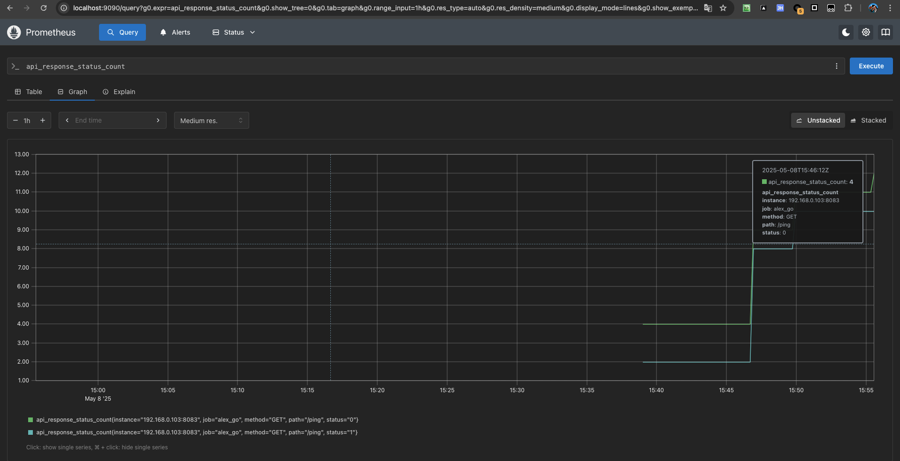
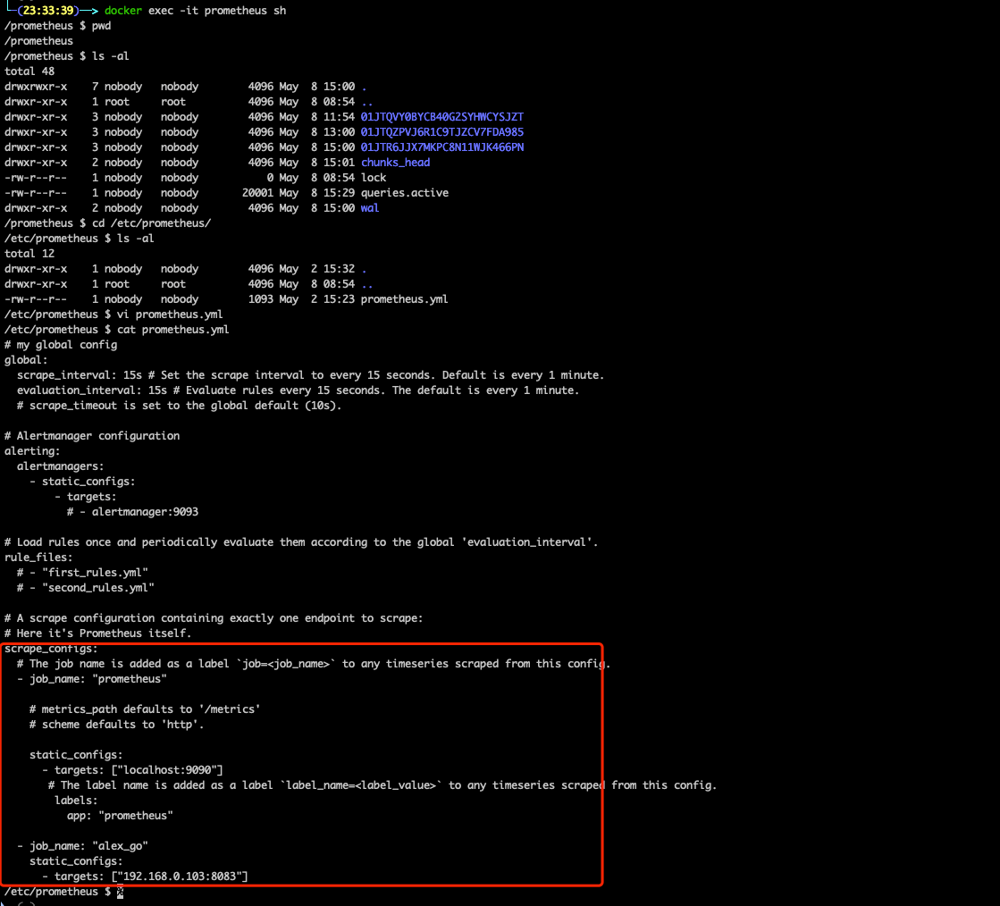
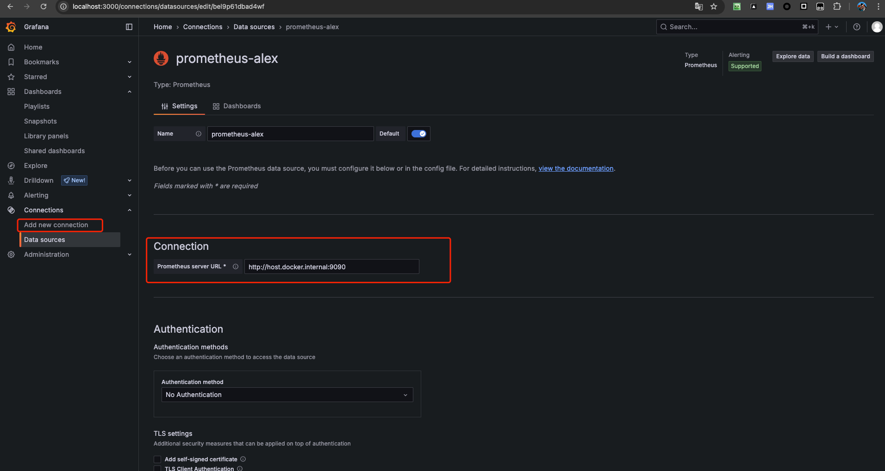
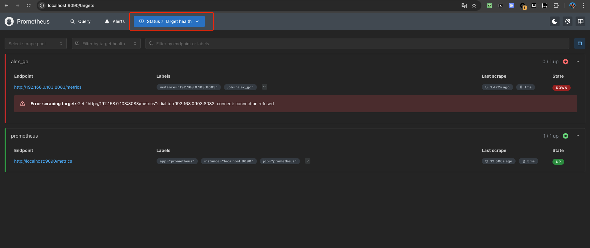

# Prometheus 普罗米修斯

## 安装 Prometheus

```bash
docker run -d --name=alex-prometheus -p 9090:9090 prom/prometheus
```



可以通过访问 `http://localhost:9090` 来访问 Prometheus 的 Web 界面。

建议挂载配置文件

```bash
docker run \
    -d \
    --name=alex-prometheus \
    -p 9090:9090 \
    -v ./prometheus.yml:/etc/prometheus/prometheus.yml \
    -v ./prometheus-data:/prometheus
    prom/prometheus
```

完整的 prometheus.yml 配置信息，可查看 https://prometheus.io/docs/prometheus/latest/configuration/configuration/

其中比较重要的是 `scrape_configs` 采集配置



## 安装 Grafana

```bash
docker run -d --name=alex-grafana -p 3000:3000 grafana/grafana-oss
```

可以通过访问 `http://localhost:3000` 来访问 Grafana 的 Web 界面。
默认用户名和密码都是 `admin`，登录后会提示修改密码。

配置 prometheus 数据源

1. 点击左侧菜单栏里的 『Connections』 图标。
2. 在数据源列表里找到 『prometheus 图标』或者搜索框输入 “prometheus” 搜索。
3. 点击 『prometheus 图标』，进入数据源页面。
4. 点击页面右上角蓝色 『Add new data source』 按钮，添加数据源。
5. 填写 Prometheus server URL (例如, http://localhost:9090/)。
6. 根据需要调整其他数据源设置(例如, 认证或请求方法等)。
7. 点击页面下方的 『Save & Test』保存并测试数据源连接。



## 使用 Prometheus 监控 Golang 程序

允许

```bash
go run prometheus.go
```

配置好 prometheus 采集配置之后

即可看到

