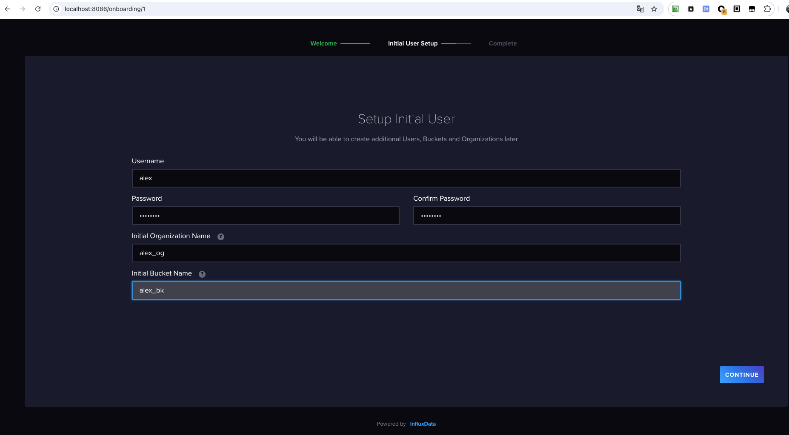
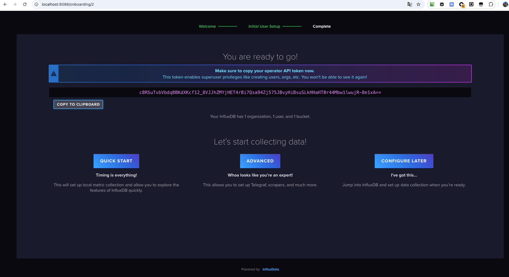
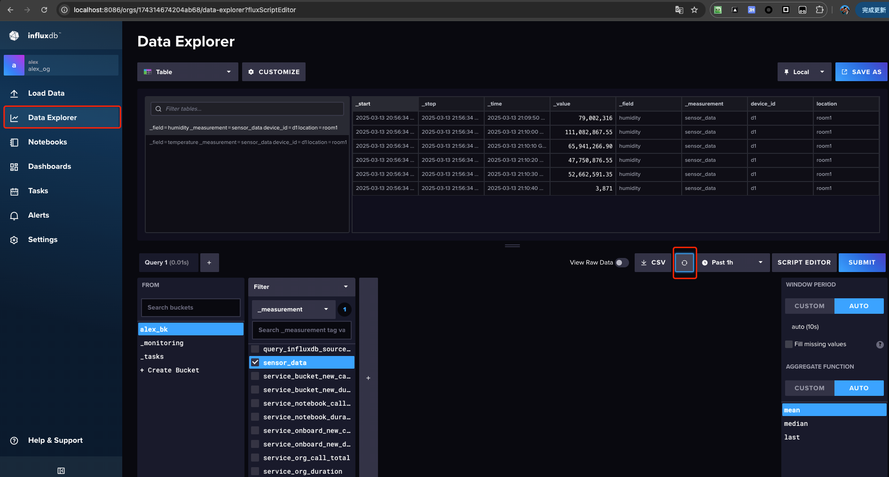

# influxDB

[influxDB](https://github.com/influxdata/influxdb) 是一个开源的分布式时序、时间和指标数据库，用于存储大量的时间序列数据，如系统监控、应用指标、传感器数据等。

## 下载安装

可以使用 [docker 镜像](https://hub.docker.com/_/influxdb) 来进行安装 influxDB


```bash
docker run \
    --name alex-influxdb \
    -p 8086:8086 \
    influxdb:2
```

当容器启动之后，可以在主机上访问 `http://localhost:8086` 来查看 influxDB 的管理界面。
第一次访问时，需要设置初始管理员账号和密码。

> 我这里设置的账号是 alex 密码为 12345678





如果要想在容器启动时，就设置账号密码，则可以运行

```bash
# $PWD/data：要挂载在容器的 InfluxDB 数据目录路径下的主机目录
# $PWD/config：要挂载到容器的 InfluxDB 配置目录路径下的主机目录
# <USERNAME>：初始管理员用户的名称
# <PASSWORD>： 初始管理员用户的密码
# <ORG_NAME>：初始组织的名称
# <BUCKET_NAME>：初始存储桶（数据库）的名称
docker run -d -p 8086:8086 \
  -v "$PWD/data:/var/lib/influxdb2" \
  -v "$PWD/config:/etc/influxdb2" \
  -e DOCKER_INFLUXDB_INIT_MODE=setup \
  -e DOCKER_INFLUXDB_INIT_USERNAME=<USERNAME> \
  -e DOCKER_INFLUXDB_INIT_PASSWORD=<PASSWORD> \
  -e DOCKER_INFLUXDB_INIT_ORG=<ORG_NAME> \
  -e DOCKER_INFLUXDB_INIT_BUCKET=<BUCKET_NAME> \
  influxdb:2
```

通过 UI 界面，我们可以清晰的看到数据



## influxDB 的基本概念

### 名词介绍

| **InfluxDB 术语** | **类比 MySQL** | **说明**                          |  
|--------------------|----------------|-----------------------------------|  
| **Measurement**    | Table          | 数据表（如 `sensor_data`）         |  
| **Point**          | Row            | 一行数据（包含时间戳）            |  
| **Tag**            | 索引列         | 用于快速过滤（如 `device_id`）    |  
| **Field**          | 普通列         | 存储实际数值（如 `temperature`）  |  
| **Bucket**         | Database       | 数据存储桶（类似数据库）           |  
| **Timestamp** |	Primary Key |	每条数据的唯一时间标识 |

### point

influxDB 中的 point 相当于传统数据库里的一行数据，由时间戳（time）、数据（field）、标签（tag）组成。

| Point 属性 | 传统数据库概念             |
| --- |---------------------|
| time | 每个数据记录时间，是数据库中的主索引  |
| field | 各种记录值（没有索引的属性），例如温度、湿度 |
| tag | 各种有索引的属性，例如地区、海拔 |