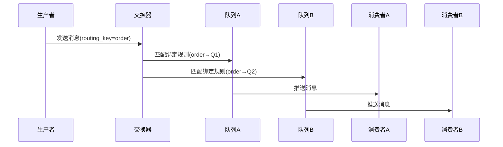

# RabbitMQ

- [官网示例教程](https://www.rabbitmq.com/getstarted.html)
- [官方示例代码，涵盖多种客户端示例](https://github.com/rabbitmq/rabbitmq-tutorials)

## 安装

使用 docker 安装：[rabbitmq docker 官方文档地址](https://registry.hub.docker.com/_/rabbitmq/)

```shell
# 安装 rabbitmq 3.11

# 临时启用
docker run -it --rm --name rabbitmq -p 5672:5672 -p 15672:15672 rabbitmq:3.11-management

# 长久使用
docker run -it --name alex-rabbitmq -p 5672:5672 -p 15672:15672 rabbitmq:3.11-management

# 浏览器访问访问 web 管理界面
# 默认的账号和密码都为 guest
http://127.0.0.1:15672
```

## 使用 Go RabbitMQ 客户端

这里我们已经没有使用 `github.com/streadway/amqp` 库了，因为这个库现在已经没有维护了。这个库也推荐直接使用 `https://github.com/rabbitmq/amqp091-go` 库。

### 消息属性

`AMQP 091` 协议预定义了消息附带的 **14** 个属性集。除以下属性外，大多数属性很少使用：

- persistent：将消息标记为持久性（值为 true）或瞬态（ false）。
- content_type：用于描述编码的 `mime` 类型。例如，对于经常使用的JSON编码，将此属性设置为 `application/json` 是一个好习惯。
- reply_to：常用于命名回调队列
- correlation_id：有助于将 RPC 响应与请求相关联。

## 一些常用命令

命令 | 含义 |
--- | ---
rabbitmqctl list_queues | 查看队列
rabbitmqctl list_queues name messages_ready messages_unacknowledged | 打印忘记确认的队列信息
rabbitmqctl list_exchanges | 列出所有的交换器
rabbitmqctl list_bindings | 列出绑定关系

## RabbitMQ 核心概念详解

#### 1. 基础架构模型
```
[生产者] → [交换器] → (路由规则) → [队列] → [消费者]
```

#### 2. 核心组件解析
| 组件       | 角色定位                     | 类比现实场景              | 核心特性                  |
|------------|----------------------------|-------------------------|-------------------------|
| **交换器** | 消息路由中枢                | 邮局分拣中心            | 不存储消息，仅转发        |
| **队列**   | 消息存储容器                | 收件人邮箱              | 先进先出，支持持久化      |
| **路由键** | 消息分发依据                | 邮件地址邮编            | 绑定规则匹配的关键参数    |

#### 3. 工作流程示例


#### 4. 四种交换器类型对比
| 类型          | 路由逻辑                    | 典型应用场景              |
|---------------|---------------------------|-------------------------|
| **直连**      | 精确匹配路由键              | 订单状态变更通知          |
| **扇出**      | 广播到所有绑定队列          | 系统公告推送              |
| **主题**      | 模糊匹配（通配符）          | 日志分级收集              |
| **头信息**    | 根据Header属性匹配          | 复杂条件路由              |


## 代码示例

- [一个最简单的生产者和消费者](./simple)
- [工作队列/任务队列](./task_worker)：消息确认、消息持久化、消息公平分发
- [发布/订阅（主要演示了 fanout 交换器的使用）](./publish_subscribe)：一个发布者发布一条消息，多个订阅者都可以接收到同样一条消息
- [路由（主要演示了 direct 交换器的使用）](./route)：生产者将消息投递到不同的路由 key 中，消费者通过订阅不同的路由 key 从而接收不同类型的消息
- [topic 交换器](./topic)
- [RPC](./rpc_sample)
- [TTL 消息](./ttl_message)：设置消息自动过期时间
- [实现延迟队列](./delay_message)：两种方式实现延迟队列