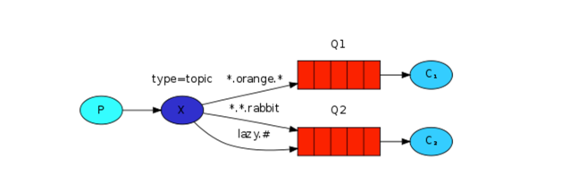

# topic 交换器


## 发送到 Topic 交换器的消息规则

发送到 Topic 交换器的消息不能具有随意的 `routing_key` —— 它必须是单词列表，以**点**分隔。这些词可以是任何东西，但通常它们指定与消息相关的某些功能。

### 有效的 `routing_key` 示例

以下是一些有效的 `routing_key` 示例：

- `stock.usd.nyse`
- `nyse.vmw`
- `quick.orange.rabbit`

`routing_key` 中可以包含任意多个单词，最多 255 个字节。

`topic` 交换器背后的逻辑类似于 `direct` 交换器——**用特定路由键发送的消息将传递到所有匹配绑定键绑定的队列**。但是，绑定键有两个重要的特殊情况：

- *（星号）可以代替一个单词。
- ＃（井号）可以替代零个或多个单词。
 
### 举个栗子🌰



假设我们设定的路由为如下规则：路由键中的第一个单词将描述速度，第二个是颜色，第三个是种类，则规则 `<speed>.<colour>.<species>`。

则：

- `Q1` 与绑定键 `*.orange.*` 绑定
- `Q2` 与绑定键 `*.*.rabbit` 和 `lazy.＃` 绑定

那么，如果键出现如下情况时：

假设键为如下时 | 消息会传递到的队列 
--- | ---
quick.orange.rabbit | Q1、Q2
lazy.orange.elephant | Q1、Q2
quick.orange.fox | Q1
lazy.brown.fox | Q2
lazy.pink.rabbit | 只会传递到 Q2 **一次**（尽管匹配了 Q2 的两个绑定）
quick.brown.fox | 消息会直接被丢弃，不会进入 Q1 或者 Q2
orange | 消息会直接被丢弃
quick.orange.male.rabbit | 消息会直接被丢弃
lazy.orange.male.rabbit | Q2


## 示例代码运行

### 启动消息消费者

启动一个终端 A，如果想要接收所有的消息时

```bash
go run subscribe_topic.go '#'
```

启动一个终端 B，要接收 `alex` 开头的所有消息时

```bash
go run subscribe_topic.go 'alex.*' 
```

启动一个终端 C，接收多个绑定时

```bash
go run subscribe_topic.go '*.hello' 'alex.*'
```

### 启动消息生产者

```bash
# 推送消息，上面 3 个终端应该都可以收到消息
go run publish_topic.go 'alex.foo' 'hello world'

# 推送消息，终端 A 和 C 可以收到消息
go run publish_topic.go 'bar.hello' 'hello world1'
```
