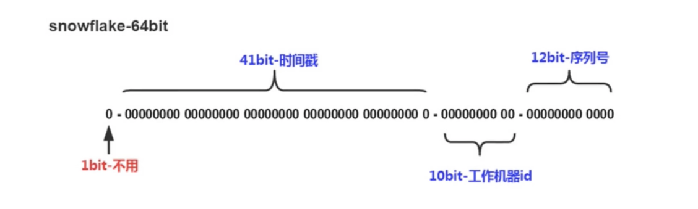

# 分布式 ID 生成器

## 分布式 ID 的特点

- 全局唯一性：不能出现有重复的 ID 标识，这是基本要求。
- 递增性：确保生成的 ID 对于用户或业务是递增的。
- 高可用性：确保任何时候都能生成正确的 ID。
- 高性能性：在高并发的环境下依然表现良好。

## 分布式 ID 应用场景

不仅仅是用于用户 ID，实际互联网中有很多场景都需要能够生成类似 MySQL 自增 ID 这样不断增大，同时又不会重复的 ID，以支持业务中的高并发场景。

比较典型的场景有：电商促销时短时间内会有大量的订单涌入到系统，比如每秒 10W+ 在这些业务场景下将数据插入数据库之前，我们需要给这些订单和数据先分配
一个唯一 ID，然后再保存到数据库中。
对这个 ID 的要求是希望其中能带有一些时间信息，这样即使我们后端的系统对数据进行了分库分表，也能够以时间顺序对这些数据进行排序。

## Snowflake 算法（雪花算法）

Twitter 的分布式 ID 生成算法，是一个经过实践考验的算法，它的核心思想是：使用一个 64 位的 long 型的数字作为全局唯一 ID。在这 64 位中，其中 1 位是不用的，然后用其中的 41 位作为毫秒数，用 10 位作为工作机器 id，12 位作为序列号。

- 1 位标识位：最高位是符号位，正数是 0，负数是 1，生成的 ID 一般是正数，所以为 0。
- 时间戳：占用 41bit，单位为毫秒，总共可以容纳约 69 年的时间。当然，我们的时间毫秒计数不会真的从 1970 年开始计，那样我们的系统跑到 2039 年 9 月 7 日 23:47:35 就不能用了，所以这里的时间戳只是相对于某个时间的增量，比如我们的系统上线是 2024-08-20，那么我们的时间戳就是当前时间减去 2024-08-20 的时间戳，得到的偏移量。
- 机器 id：占用 10bit，其中高位 5bit 是数据中心 ID（datacenterId），低位 5bit 是机器 ID（workerId），可以部署在 2^5=32 个机房，每个机房可以部署 2^5=32 台机器，可以容纳 1024 个节点。
- 序列号：占用 12bit，用来记录同毫秒内产生的不同 ID。每个节点每毫秒开始不断累加，最多可以累加到 4095，同一毫秒一共可以产生 4096 个 ID。

### SnowFlake 算法在同一毫秒内最多可以生成多少个全局唯一 ID 呢？

同一毫秒的 ID 数量 = 1024 * 4096 = 4194304，也就是说在同一毫秒内最多可以生成 4194304 个全局唯一 ID。

### 雪花算法的 Go 语言实现

- [bwmarrin/snowflake](https://github.com/bwmarrin/snowflake)：是一个相当轻量化的 snowflake 算法实现
- [sony/sonyflake](https://github.com/sony/sonyflake)：是 Sony 公司的一个开源项目，基本思路和 Twitter 的 snowflake 算法一样，但是在位分配上稍有不同

以上两个库的示例代码，都可以通过查看 [snow_flake](./snow_flake.go) 文件来查看。