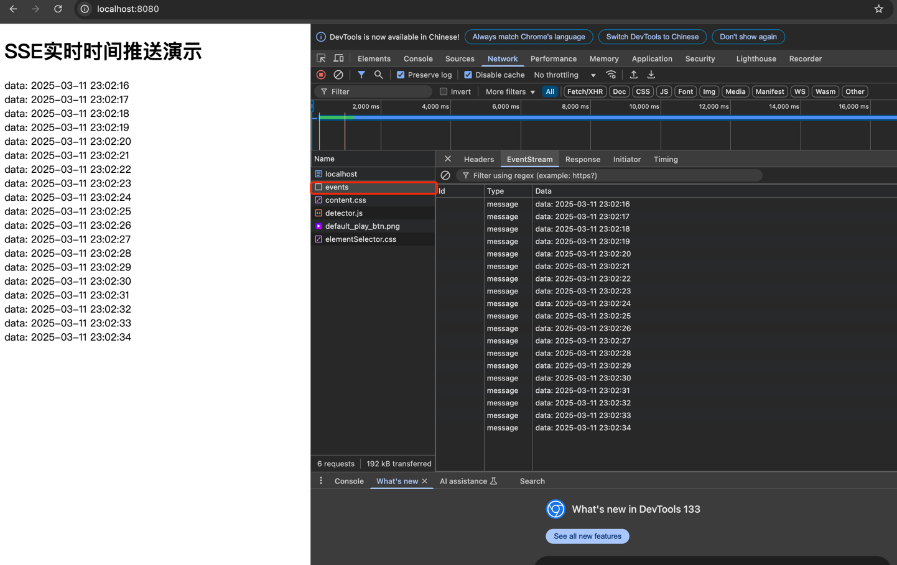

## 什么是 SSE

SSE（Server-Sent Events）是一种允许服务器主动向客户端推送数据的技术，就像你的手机收到微信消息推送一样。基于HTTP协议，保持长连接。SSE是HTML5规范的一部分，目前主流浏览器都支持。

## 运行服务

```bash
go run sse.go
```

然后浏览器访问 `http://localhost:8080` 即可。

会看到如下类似

